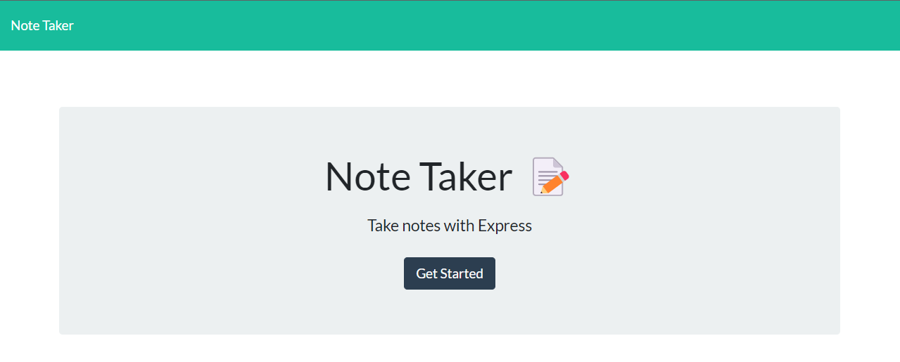
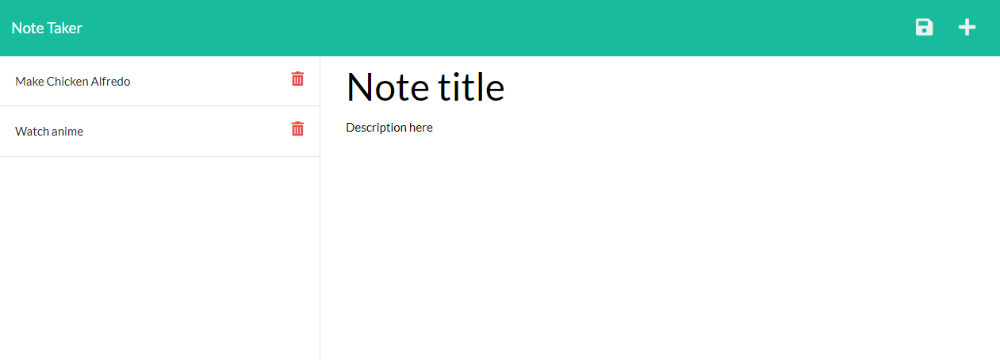

# Express.js: Note Taker

## Description

I need to modify a starter code to create an application called Note Taker that can be used to write and save notes. This application will use an Express.js back end and will save and retrieve note data from a JSON file.

Back-end needs to be built and connect and then deploy the entire application to Heroku.


## User Story

```
AS A small business owner
I WANT to be able to write and save notes
SO THAT I can organize my thoughts and keep track of tasks I need to complete
```
## Instructions
* Clone this repository
* Download Node.js at https://nodejs.org/en/download/
* Install required packages by typing npm install in the terminal

## Mock-Up

The following images show the web application's appearance and functionality:





